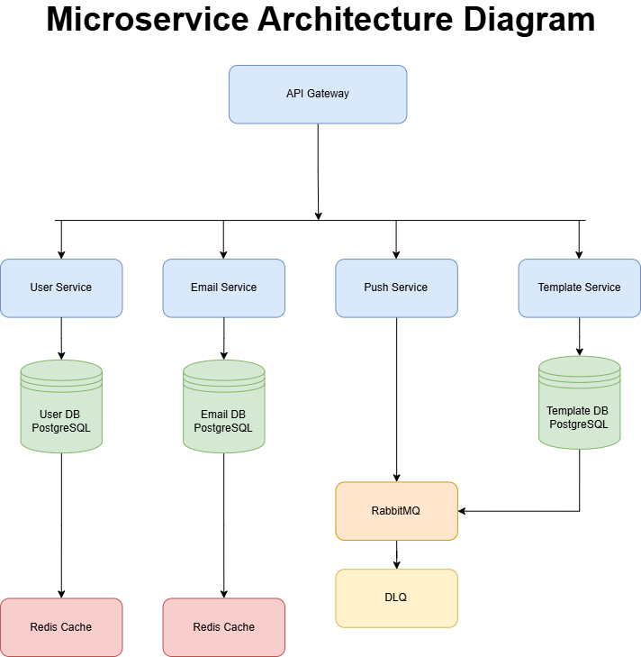

# Distributed Notification System

Microservices-based notification system with email and push notifications.

## Team Members
- Member 1: Infrastructure + API Gateway (@teammate1)
- Member 2: User Service (@teammate2)
- Member 3: Email + Push Services (@teammate3)
- Member 4: Template Service + DevOps (@teammate4)

## Quick Start
```bash
# 1. Start infrastructure
docker-compose up -d

# 2. Check services
docker-compose ps

# 3. Access services
# - API Gateway: http://localhost:3000
# - RabbitMQ UI: http://localhost:15672 (rabbit_user/rabbit_password)
# - PostgreSQL: localhost:5432
```

## Architecture

- 5 Microservices (API Gateway, User, Email, Push, Template)
- PostgreSQL (3 databases)
- RabbitMQ (Message queue with DLQ)
- Redis (Cache)


## Microservice Architecture Diagram




## Development

See CONTRIBUTING.md for stacked PRs workflow.